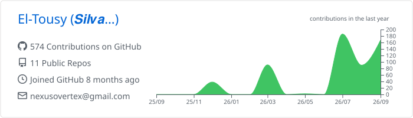
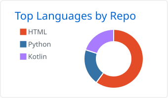
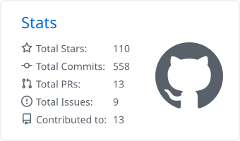

             
# 𝑺𝒊𝒍𝒗𝒂𝒙𝒔  
     
### Junior Software Developer · Python & Web Development · IT Systems  
  
I build practical, real-world software — from debugging and testing to full applications — and I keep learning how software and IT systems fit together.

 
Morocco 🇲🇦 · freelance and junior roles · Python · SQL · Web Development
  

---

<table>   
<tr>        
<td width="70%">
            

            
## Profile

I'm , from Morocco 🇲🇦 , passionate about IT, software development and building practical solutions.   

I enjoy working on real-world projects, exploring new technologies and understanding how software and IT systems work together.      
           
I am a junior software developer with experience in Python, web development, SQL and software projects. 

I can help with debugging, fixing errors, testing applications and developing small software solutions. 

---

</td>
<td width="70%">

</td>
</tr>
</table>

## Tech Stack

### 💻 Development

### 🖥️ Tools

 

---

## What I've been building
-  Building **[Alexandra](https://github.com/Nexus-Vertex/Alexandra-AI-Voice-Assistante)** — an AI Voice Assistant (PFE 2026)
-  Migrated **[GLPI 10 to GLPI 11](https://github.com/Nexus-Vertex/glpi-10-to-11-docker-migration)** via Docker
-  Built an **[Admin Dashboard](https://github.com/Nexus-Vertex/Admin-dashboard-project-internship-Giga-Manager-overview-screenshots-only)** for website & user management during my internship
-  Designed a **[Weather Supervision Dashboard](https://github.com/Nexus-Vertex/Weather-supervision-dashboard-showcase)** with live map, alarms & KPIs 
-  Built a **[WhatsApp Bot](https://github.com/Nexus-Vertex/Meta-API-python-whatsapp-bot)** using the Meta API and OpenAI
-  Developed a full **[E-Commerce website](https://github.com/Nexus-Vertex/.-VELO-STOR-Online-Store-Web-Project)** from scratch

Every project I create solves a real problem or teaches me something new.

If you want to see what I'm working on, explore my repositories below ⬇️

---
## GitHub activity

<picture>
  <source media="(prefers-color-scheme: dark)" srcset="profile-summary-card-output/github_dark/0-profile-details.svg">
  <source media="(prefers-color-scheme: light)" srcset="profile-summary-card-output/github/0-profile-details.svg">
  
</picture>

  <picture>
    <source media="(prefers-color-scheme: dark)" srcset="profile-summary-card-output/github_dark/1-repos-per-language.svg">
    <source media="(prefers-color-scheme: light)" srcset="profile-summary-card-output/github/1-repos-per-language.svg">
    
  </picture>
  <picture>
    <source media="(prefers-color-scheme: dark)" srcset="profile-summary-card-output/github_dark/3-stats.svg">
    <source media="(prefers-color-scheme: light)" srcset="profile-summary-card-output/github/3-stats.svg">
    
  </picture>

---

## 👾 Contribution Graph

 

<picture>
  <source
    media="(prefers-color-scheme: dark)"
    srcset="https://github.com/jkdevcode/github-pacman/raw/output/pacman-contribution-graph-dark.svg"
  />
  <source
    media="(prefers-color-scheme: light)"
    srcset="https://github.com/jkdevcode/github-pacman/raw/output/pacman-contribution-graph.svg"
  />
  
</picture>

---

## Let's connect

Feel free to reach out if you have a question or a project idea for me!

